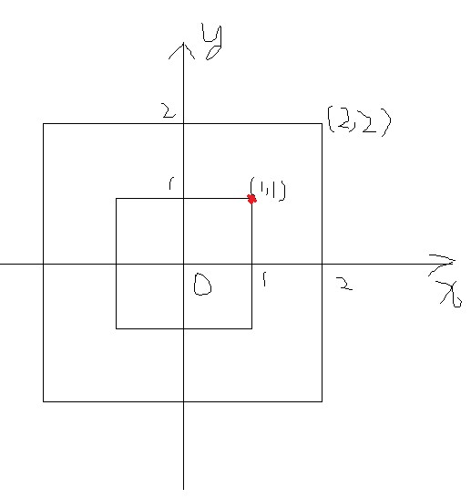

# 实现一个图片查看器

## 原由

最近产品要实现一个图片查看器，类似微信或者今日头条查看图片的效果，支持一些手势缩放、下拉退出等功能。    
刚开始听到这个需求是懵逼的，脑子里大概只有些transform来实现缩放位移效果，于是开始了面向搜索引擎编程的旅程···     
这里就把学习的过程详细的讲一讲

## 需求

几个重要的需求点

1. 图片正常大小宽度固定为设备宽度，高度自适应；高度不超过设备高度的居中，超过设备高度后，图片顶部与设备顶部对齐，可上下滑动查看
2. 图片在原状态双击放大至两倍，从放大状态双击还原
3. 图片可用手势缩放，最大放大4倍，最小就是原状态
4. 当图片超过4倍或者小于1倍时，手势可继续缩放，但是松手后会还原至4倍或者1倍
5. 图片放大后可拖拽查看，拖拽边界为图片边界
6. 图片放大之后，如果高度还是没有超过设备高度，依然居中显示，并且上下不可拖拽
7. 单击可退出查看器
8. 下拉图片可推出查看器

其中最重要的就是如何实现缩放了，先来看看这部分如何实现

## 缩放

提到缩放，首先想到的就是transform的scale属性，以及拖动的时候要使用translate属性。当然还有一个matrix属性，可以同时解决缩放以及位移    
我们这儿因为要频繁的计算缩放、位移并且直接赋值给style，所以用matrix清晰一些，关于matrix可以看这篇文章 [matrix](https://juejin.im/entry/5b15ffa0e51d4506be266bac)

使用transform还有一个需要注意的点，就是变换基点，也就是`transform-origin`属性，默认值是`50% 50%`，也就是中点位置。     
正常高度不超过设备高度的图片，用中点作为基点即可。但是高度超过的图片是顶部对齐的，因此这儿的基点不能用中点，这边采用的是`0 0`,也就是左上角。具体原因下面再说。

## 双指缩放

自从iPhone支持多点触控之后，到现在大部分手机都支持这个特性，通过不同的触控组合形成不同的手势，比如我们这儿需要的双指缩放    
通过触摸事件的`e.touches`可以知道触点的个数以及各自的位置坐标，计算双指手势产生的距离来计算出一个倍数应用到图片上

## 缩放倍数的计算

从双指手势产生的距离计算一个倍数，如何计算，这关乎到最终的用户体验。用touchmove时两个手指间的距离除以touchstart时的距离，得到一个倍数     
一开始的算法是用这个倍数加上图片目前的倍数，然后再减去1。我们设图片放大后的倍数为y，touchstart时的距离为10，touchmove移动的距离是x     
最终得到这样一个函数`y=1+(n(n+1))/20`，很显然这是一个二次函数，这导致的结果就是倍数变化的速度是随着移动距离的增加而增加的，具体到体验的话     
就是双指轻轻移动下，图片就会一下子变得很大，放大的速度与用户双指移动速度无关，只与移动距离有关，用户体验极差

经过一番对高中数学的复习之后，换了这样一个策略，我们还是设放大后倍数为y，touchmove移动的距离是x，图片原始宽度为100，我们直接把移动的距离    
增加到图片的宽度上去，然后计算倍数，可以得到这样一个函数`y=(100+x)/100`,这样子就是一个线性函数了，用户移动速度不变，放大速度就不变，感觉上就顺滑很多

## 放大点的固定

当在双击放大或者双指放大的时候，我们希望放大结束后双击的那个点还在手指下，或者还在双指的中点位置。     
比方说，双击的点坐标是(x,y)，放大两倍之后坐标变成了(2x,2y)，但是触点还是(x,y)，那这个放大就不精确了    
如图所示     
      
图中红点为触点，坐标(1,1)，放大之后这个点就在(2,2)了，脱离了红点。

我们以高度不超过设备高度的图片为例，我们实现这个效果有两个方法    
1. 每次以触点或者双指中点为变换基点      
2. 基点不变，在进行倍数变化的同时进行位移
