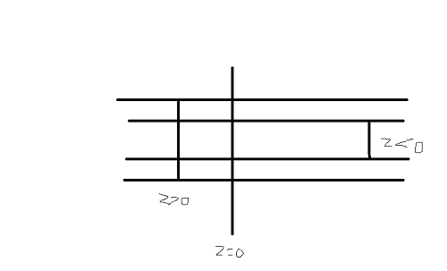
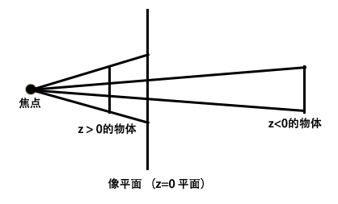

# 视差滚动效果

目前很多网站主页都采用了这样一种效果，看上去蛮酷炫的，研究研究几种实现方式

### CSS3实现

想要用CSS3来实现，首先得搞懂3D transform才行

#### X,Y,Z轴

以文档左上角为原点，往右X轴正方向，往下Y轴正方向，往屏幕上方为Z轴正方向    
rotateX,rotateY,rotateZ分别是绕X,Y,Z轴旋转    
translateX,translateY,translateZ分别是沿X,Y,Z轴平移    
translate3D()三个“参数”，分别是平移的大小

#### 透视点

上面说的沿Z轴平移，如果没有perspective这个属性是没有用的，并不是没起效，而是没有透视点，导致投影没有变化    
如图     
     
没有透视点，无论怎么移动，投影大小不变

perspective是设置透视点位置的，大小像素表示    
如图     
     
图中焦点就是透视点所在，当物体在Z轴上移动时，它在z=0平面的投影才有大小的变化（最基本的数学知识啦）   

#### 如何实现

有了以上的知识，怎么实现就水到渠成了，将两个图片分布在Z轴不同位置上，当移动相同大小的滚动条，他们的投影     
有的移动的多，有的移动的少，那么我们看到的就是有快有慢了（路程除以时间嘛），这就是视差滚动效果了

#### 注意点

有个地方需要注意下，不说可能意识不到     
当我们变化一个容器Z轴值得时候，它会变大变小，此时它本身大小并没有变化，只是他的投影在变化     
比如说，现在有一个图片高为400px，它的投影是他的两倍大小，那么当我们滑动100px滑动条时，它的投影实际上滑动了200px